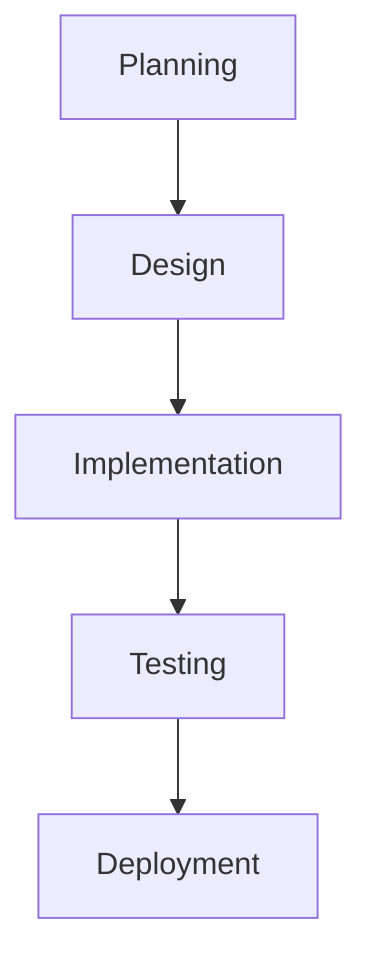
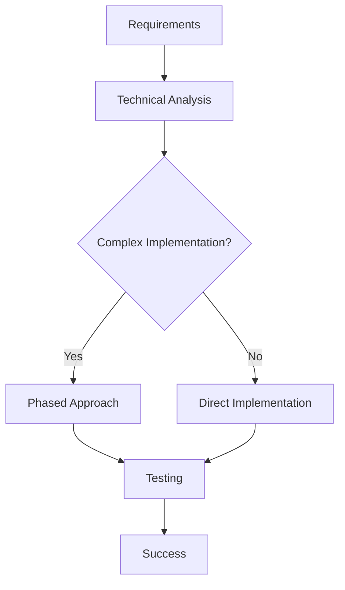
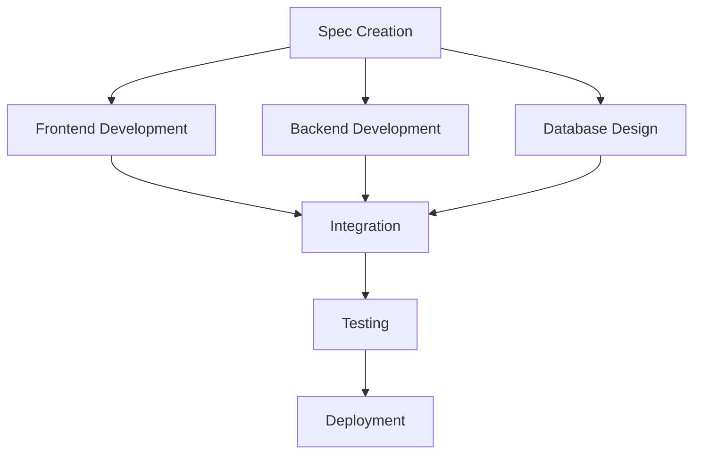

# Technical Specification

This is the technical specification for the spec detailed in @.agent-os/specs/2025-07-25-agent-os-system-enhancement/spec.md

> Created: 2025-07-25
> Version: 1.0.0

## Technical Requirements

- Modify the global @~/.agent-os/instructions/create-spec.md file to include executive summary generation
- Add executive summary section to the spec.md template in step 6 of create-spec process
- Integrate mermaid flowchart generation as part of the spec creation workflow
- Ensure compatibility with existing Agent OS instruction parsing and execution
- Maintain backward compatibility with current create-spec functionality
- Support consistent formatting across all repository types

## Approach Options

**Option A:** Add executive summary as separate file
- Pros: Modular structure, optional inclusion, easier to maintain separately
- Cons: Multiple files to track, potential for inconsistency, harder to reference

**Option B:** Integrate executive summary into existing spec.md (Selected)
- Pros: Single source of truth, always included, easier to maintain consistency
- Cons: Larger spec files, potential template complexity

**Option C:** Generate executive summary on-demand
- Pros: Flexible generation, reduces spec file size, generated when needed
- Cons: Additional complexity, potential for drift from spec content

**Rationale:** Option B provides the best balance of consistency and usability. Having the executive summary in the main spec file ensures it's always present and up-to-date with the spec content.

## Implementation Design

### Modification to create-spec.md

#### New Step Addition
Add new step after current step 6 (create_spec_md) and before step 7 (create_technical_spec):

```xml
<step number="7" name="create_executive_summary">

### Step 7: Create Executive Summary

<step_metadata>
  <adds>executive summary section to spec.md</adds>
  <generates>mermaid flowchart</generates>
</step_metadata>

<executive_summary_template>
  ## Executive Summary

  ### Overview
  [2-3_SENTENCE_SUMMARY_OF_SPEC_PURPOSE_AND_SCOPE]

  ### Key Deliverables
  - [DELIVERABLE_1]
  - [DELIVERABLE_2] 
  - [DELIVERABLE_3]

  ### Implementation Flow

  ```mermaid
  flowchart TD
      A[Spec Planning] --> B[Requirements Analysis]
      B --> C[Technical Design]
      C --> D[Implementation]
      D --> E[Testing & Validation]
      E --> F[Deployment]
      F --> G[Success Criteria Met]
  ```

  ### Success Criteria
  - [MEASURABLE_OUTCOME_1]
  - [MEASURABLE_OUTCOME_2]
  - [MEASURABLE_OUTCOME_3]

  ### Estimated Effort
  **Total Effort:** [TIME_ESTIMATE] ([EFFORT_SCALE])
  **Key Phases:** [PHASE_BREAKDOWN]
</executive_summary_template>

<mermaid_generation_rules>
  <basic_flow>
    - Start with spec planning or requirements
    - Show major phases of implementation
    - Include decision points if applicable
    - End with success criteria or deployment
    - Keep to 5-8 nodes maximum for clarity
  </basic_flow>
  
  <node_types>
    - Rectangles for processes/tasks
    - Diamonds for decisions
    - Circles for start/end points
    - Use consistent styling
  </node_types>
</mermaid_generation_rules>

<instructions>
  ACTION: Add executive summary section to spec.md before technical specs
  GENERATE: Appropriate mermaid flowchart based on spec complexity
  CUSTOMIZE: Flow based on specific spec requirements
  INTEGRATE: Seamlessly with existing spec structure
</instructions>

</step>
```

### Template Integration Points

#### Updated spec.md Template Structure
```markdown
# Spec Requirements Document

> Spec: [SPEC_NAME]
> Created: [DATE]
> Status: Planning

## Executive Summary
[NEW SECTION - Generated by step 7]

## Overview
[Existing content]

## User Stories
[Existing content]

[... rest of existing template]
```

### Mermaid Flowchart Patterns

#### Simple Linear Flow


#### Flow with Decision Points


#### Parallel Workflow


## External Dependencies

**No new dependencies required**
- Uses existing Agent OS instruction parsing
- Leverages standard mermaid syntax (widely supported)
- Integrates with current spec.md generation process

## Implementation Steps

### 1. Backup Current create-spec.md
- Create backup of existing @~/.agent-os/instructions/create-spec.md
- Ensure rollback capability if issues arise

### 2. Update Step Numbering
- Renumber existing steps 7-15 to steps 8-16
- Update all cross-references and dependencies

### 3. Insert New Step 7
- Add executive summary creation step
- Include mermaid flowchart generation
- Integrate with existing spec.md template

### 4. Update Cross-References
- Modify references to step numbers in other steps
- Update any process flow documentation
- Ensure instruction consistency

### 5. Test with Sample Specs
- Test enhanced create-spec with various spec types
- Validate mermaid flowchart generation
- Verify executive summary quality and relevance