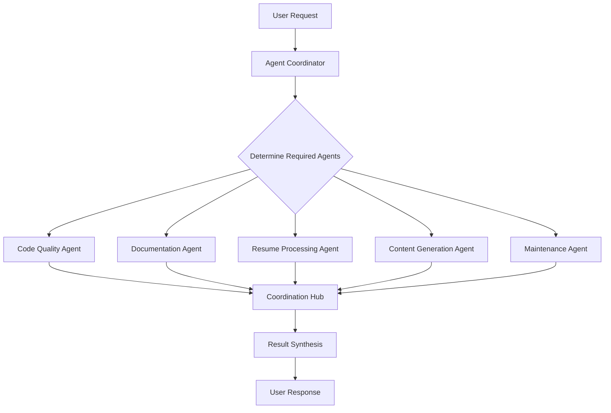

# Technical Specification

This is the technical specification for the spec detailed in @.agent-os/specs/2025-07-25-sub-agents-enhancement/spec.md

> Created: 2025-07-25
> Version: 1.0.0

## Technical Requirements

- Create specialized sub-agent configurations that integrate with existing Agent OS structure
- Implement agent coordination system for multi-agent workflows
- Ensure sub-agents work within Claude Code's existing tool and permission framework
- Provide clear boundaries and capabilities for each sub-agent type
- Support both automated and user-triggered agent activation
- Maintain compatibility with current TeamResumes workflows and build processes

## Approach Options

**Option A:** External Agent Framework Integration
- Pros: Powerful multi-agent capabilities, advanced coordination, industry-standard tools
- Cons: Complex setup, external dependencies, potential security concerns, learning curve

**Option B:** Claude Code Sub-Agent Configuration (Selected)
- Pros: Uses existing infrastructure, simple setup, security model already established, immediate integration
- Cons: Limited to Claude Code capabilities, may require custom coordination logic

**Option C:** Hybrid Approach with Gradual Enhancement
- Pros: Best of both worlds, evolutionary implementation, risk mitigation
- Cons: More complex architecture, potential inconsistencies, longer development time

**Rationale:** Option B leverages the existing Claude Code framework and Agent OS structure, providing immediate value while maintaining security and simplicity. The sub-agents can be implemented as specialized prompt configurations and workflow templates within the current system.

## Sub-Agent Architecture

### Core Sub-Agent Types

#### 1. Code Quality Agent
**Purpose:** Automated code review, formatting, and best practices enforcement
**Capabilities:**
- Python code analysis and formatting recommendations
- Batch script validation and optimization
- CSS and stylesheet consistency checking
- File organization and naming convention enforcement
- Code documentation completeness validation

**Configuration:**
```yaml
name: "code-quality-agent"
specialization: "code-review-and-formatting"
triggers:
  - file_changes: ["*.py", "*.bat", "*.css", "*.md"]
  - manual_activation: true
  - scheduled: "daily"
tools:
  - code_analysis
  - file_operations
  - documentation_generation
```

#### 2. Documentation Agent
**Purpose:** Automatic documentation updates, consistency checks, and generation
**Capabilities:**
- README.md maintenance and updates
- Code comment generation and validation
- API documentation creation
- Cross-reference link validation
- Documentation consistency across files

**Configuration:**
```yaml
name: "documentation-agent"
specialization: "documentation-maintenance"
triggers:
  - code_changes: true
  - new_features: true
  - manual_activation: true
tools:
  - documentation_generation
  - file_operations
  - cross_reference_validation
```

#### 3. Resume Processing Agent
**Purpose:** Specialized assistance for resume formatting, validation, and conversion
**Capabilities:**
- Resume markdown validation and formatting
- PDF generation quality assurance
- Resume template consistency enforcement
- Skills section standardization
- Experience formatting validation

**Configuration:**
```yaml
name: "resume-processing-agent"
specialization: "resume-management"
triggers:
  - resume_file_changes: ["*_resume.md"]
  - pdf_generation_requests: true
  - manual_activation: true
tools:
  - markdown_processing
  - pdf_generation
  - template_validation
```

#### 4. Content Generation Agent
**Purpose:** LinkedIn posts, social media content, and marketing materials
**Capabilities:**
- LinkedIn post generation from resume updates
- Social media content creation
- Professional bio generation
- Achievement highlight extraction
- Industry-specific content adaptation

**Configuration:**
```yaml
name: "content-generation-agent"
specialization: "social-media-content"
triggers:
  - resume_updates: true
  - new_achievements: true
  - manual_activation: true
tools:
  - content_generation
  - template_processing
  - social_media_formatting
```

#### 5. Maintenance Agent
**Purpose:** Dependency updates, security monitoring, and project health checks
**Capabilities:**
- Python dependency monitoring and updates
- File system health checks
- Build script validation
- Security vulnerability scanning
- Performance monitoring and optimization

**Configuration:**
```yaml
name: "maintenance-agent"
specialization: "project-maintenance"
triggers:
  - scheduled: "weekly"
  - dependency_alerts: true
  - manual_activation: true
tools:
  - dependency_management
  - security_scanning
  - performance_monitoring
```

### Agent Coordination System

#### Coordination Architecture


#### Coordination Protocols

**Sequential Execution:**
- Code Quality → Documentation → Resume Processing
- Ensures quality before documentation updates
- Documentation reflects code improvements

**Parallel Execution:**
- Content Generation + Maintenance Agent
- Independent tasks that don't conflict
- Improved efficiency for unrelated operations

**Conditional Activation:**
- Resume Processing → Content Generation (if resume updated)
- Maintenance → Code Quality (if issues found)
- Smart triggering based on context

## Implementation Design

### File Structure
```
.agent-os/
├── sub-agents/
│   ├── configurations/
│   │   ├── code-quality-agent.yaml
│   │   ├── documentation-agent.yaml
│   │   ├── resume-processing-agent.yaml
│   │   ├── content-generation-agent.yaml
│   │   └── maintenance-agent.yaml
│   ├── templates/
│   │   ├── prompts/
│   │   │   ├── code-review-prompt.md
│   │   │   ├── documentation-update-prompt.md
│   │   │   └── resume-validation-prompt.md
│   │   └── workflows/
│   │       ├── quality-check-workflow.md
│   │       └── content-generation-workflow.md
│   └── coordination/
│       ├── agent-coordinator.md
│       └── workflow-definitions.yaml
```

### Integration with Claude Code

#### CLAUDE.md Enhancement
```markdown
## Sub-Agent System

### Available Sub-Agents
- **Code Quality Agent:** @.agent-os/sub-agents/configurations/code-quality-agent.yaml
- **Documentation Agent:** @.agent-os/sub-agents/configurations/documentation-agent.yaml
- **Resume Processing Agent:** @.agent-os/sub-agents/configurations/resume-processing-agent.yaml
- **Content Generation Agent:** @.agent-os/sub-agents/configurations/content-generation-agent.yaml
- **Maintenance Agent:** @.agent-os/sub-agents/configurations/maintenance-agent.yaml

### Agent Activation
Use `/activate-agent [agent-name]` to trigger specific sub-agents
Use `/coordinate-agents [task-description]` for multi-agent workflows
```

#### Agent Activation Commands
```bash
# Single agent activation
claude "/activate-agent code-quality-agent"

# Multi-agent coordination
claude "/coordinate-agents 'Update resume and generate LinkedIn content'"

# Automated workflow
claude "/workflow quality-assurance-pipeline"
```

## External Dependencies

**Enhanced Configuration Files:**
- **YAML Parser** - For agent configuration management
- **Template Engine** - For prompt and workflow templates
- **Coordination Logic** - For multi-agent workflow management

**Integration Points:**
- **Existing Claude Code Tools** - Leverage current tool permissions
- **Agent OS Framework** - Build on existing documentation structure
- **TeamResumes Workflows** - Integrate with current build processes

## Security and Permissions

### Agent Permission Model
```yaml
code-quality-agent:
  permissions:
    - read: ["*.py", "*.bat", "*.css", "*.md"]
    - write: ["*.py", "*.bat", "*.css"] # with user approval
    - execute: ["code_analysis", "formatting_tools"]

documentation-agent:
  permissions:
    - read: ["*.md", "*.py", "*.bat"]
    - write: ["README.md", "docs/*"] # with user approval
    - execute: ["documentation_generation"]
```

### Safety Measures
- All file modifications require user approval
- Agents operate within defined scope boundaries
- Audit logging for all agent actions
- Rollback capability for agent-initiated changes
- Clear indication when agents are active vs. inactive

## Performance Considerations

### Efficiency Optimizations
- Agent activation based on file change triggers
- Parallel execution for independent tasks
- Caching of agent analysis results
- Incremental processing for large repositories

### Resource Management
- Memory-efficient agent loading
- CPU usage monitoring and throttling
- Disk space management for generated content
- Network usage optimization for external tool access