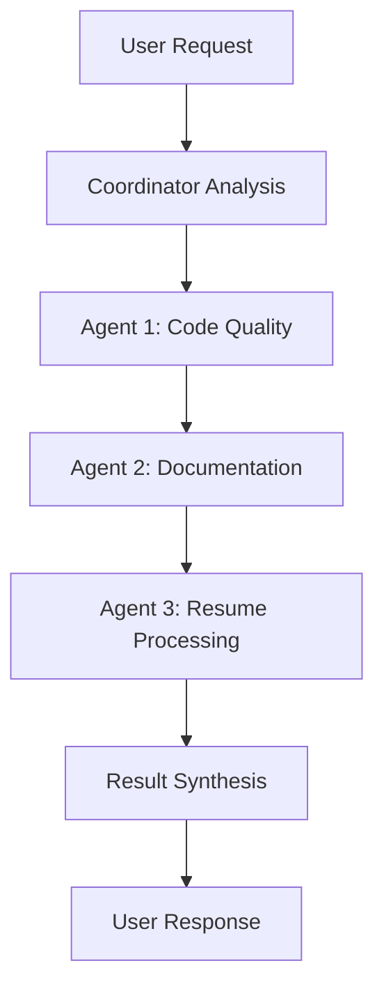
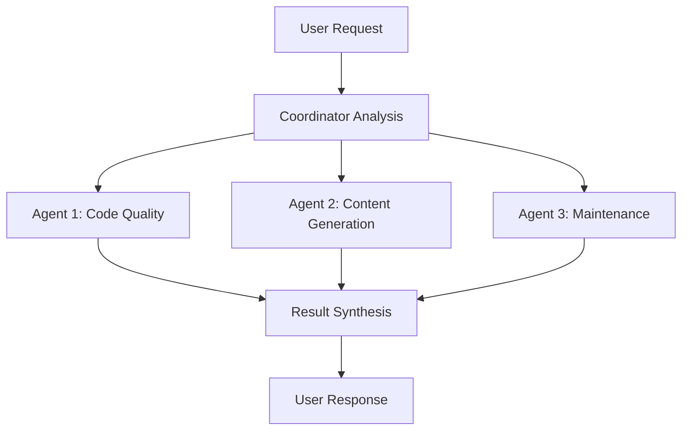
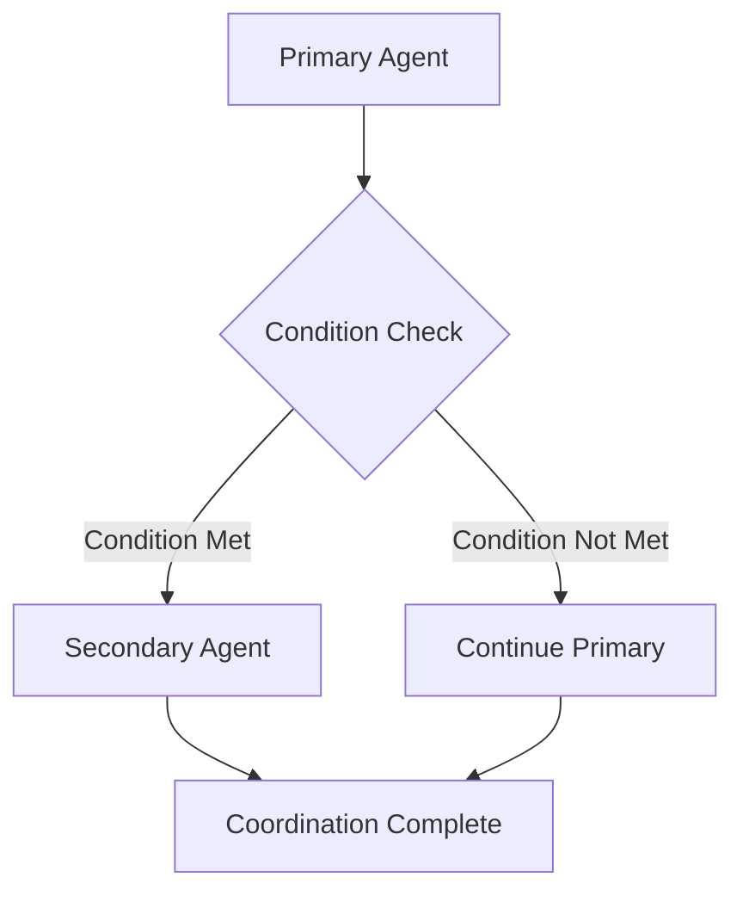

# Agent Coordination System

> This document defines how sub-agents coordinate and work together
> Version: 1.0.0
> Created: 2025-07-25

## Overview

The Agent Coordination System manages interactions between multiple sub-agents, ensuring they work together effectively without conflicts or resource contention.

## Coordination Principles

### 1. Clear Boundaries
- Each agent has well-defined responsibilities
- No overlap in core functionality
- Clear handoff points between agents

### 2. Communication Protocols
- Agents communicate through the coordination hub
- All messages are logged for audit purposes
- Results are aggregated before presenting to user

### 3. Resource Management
- Only one agent can modify a file at a time
- Shared resources require coordination locks
- Priority system resolves conflicts

## Coordination Workflows

### Sequential Execution


**Use Cases:**
- Code quality → Documentation updates
- Resume updates → Content generation
- Maintenance → Code quality checks

### Parallel Execution


**Use Cases:**
- Independent analysis tasks
- Non-conflicting file operations
- Parallel content generation

### Conditional Activation


**Use Cases:**
- Resume updates trigger content generation
- Code changes trigger documentation updates
- Quality issues trigger maintenance actions

## Agent Priority System

### Priority Levels
1. **High Priority**: Code Quality Agent, Maintenance Agent
2. **Normal Priority**: Documentation Agent, Resume Processing Agent
3. **Low Priority**: Content Generation Agent

### Conflict Resolution
- Higher priority agents get resource preference
- Conflicting operations are queued sequentially
- User approval required for conflicting writes

## Coordination Commands

### Manual Coordination
```bash
# Activate specific agent
claude "/activate-agent code-quality"

# Coordinate multiple agents
claude "/coordinate-agents 'Review code and update docs'"

# Execute workflow
claude "/workflow quality-assurance-pipeline"
```

### Automatic Coordination
- File change triggers activate relevant agents
- Dependency chains execute automatically
- Scheduled coordination for maintenance tasks

## Message Format

### Agent Communication Schema
```yaml
message:
  from: "agent-name"
  to: "coordinator" | "agent-name"
  type: "request" | "response" | "notification"
  payload:
    action: "action-type"
    data: {...}
    metadata:
      timestamp: "ISO-8601"
      priority: "high|normal|low"
      requires_approval: boolean
```

### Example Messages
```yaml
# Request message
message:
  from: "code-quality-agent"
  to: "coordinator"
  type: "request"
  payload:
    action: "request_documentation_update"
    data:
      files_modified: ["main.py", "utils.py"]
      changes_summary: "Added new functions"
    metadata:
      timestamp: "2025-07-25T10:30:00Z"
      priority: "normal"
      requires_approval: false

# Response message
message:
  from: "documentation-agent"
  to: "coordinator"
  type: "response"
  payload:
    action: "documentation_updated"
    data:
      files_updated: ["README.md"]
      changes_made: "Added function documentation"
    metadata:
      timestamp: "2025-07-25T10:35:00Z"
      priority: "normal"
      requires_approval: true
```

## Error Handling

### Agent Failures
- Failed agents don't block other agents
- Error messages are logged and reported
- Fallback procedures for critical operations

### Coordination Conflicts
- Resource locks prevent simultaneous modifications
- Conflict detection and resolution algorithms
- User notification for unresolvable conflicts

### Recovery Procedures
- Agent restart capabilities
- State recovery from logs
- Manual intervention protocols

## Security Considerations

### Agent Isolation
- Agents cannot directly access each other's configurations
- Communication only through coordination hub
- Audit logging for all interactions

### Permission Enforcement
- Coordination system enforces individual agent permissions
- No privilege escalation through coordination
- User approval required for sensitive operations

### Monitoring and Auditing
- All coordination activities are logged
- Performance metrics tracked
- Security violations detected and reported

## Performance Optimization

### Efficient Coordination
- Minimal overhead for simple operations
- Caching of coordination decisions
- Parallel execution where possible

### Resource Management
- Memory usage monitoring
- CPU time allocation
- Disk space management

### Scalability
- Support for additional agents
- Configurable coordination policies
- Load balancing for heavy operations